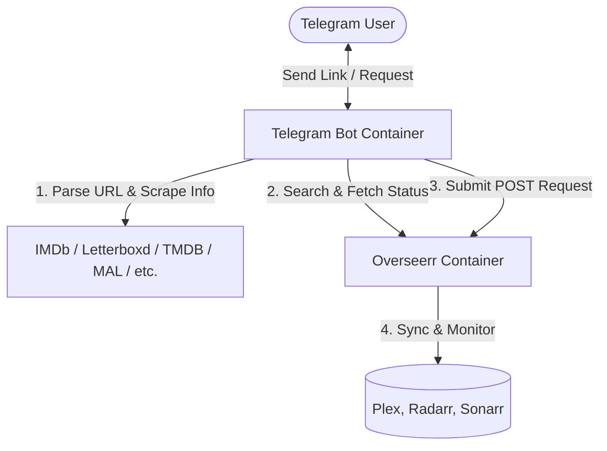

# Movie Request Agent: Telegram + Seerr (Overseerr) Docker App

A Dockerized Python application that parses media links sent to a Telegram bot, extracts the media information (Film, TV Show, or Anime), matches it against the Seerr API.

## Features

- **Link Scraping & Parsing:** Automatically extracts media titles and release years from movie databases, streaming services, and anime sites (IMDb, Letterboxd, TMDB, MyAnimeList, AniList, Netflix, etc.).
- **Smart Direct Bypass:** Directly queries Overseerr if a direct TMDB link is provided, skipping the search phase.
- **Top 5 Selection Keyboard:** Returns the top 5 results sorted by year/media type matching, allowing the user to select the correct media.
- **Detailed Preview:** Shows a preview of the plot, type, and current library availability status in Seerr (`Available`, `Processing`, `Pending Approval`, or `Not Requested`).

---

## Architecture



---

## Getting Started

### 1. Prerequisites
Ensure you have [Docker](https://www.docker.com/) and [Docker Compose](https://docs.docker.com/compose/) installed on your machine.

### 2. Setup the Telegram Bot
1. Open Telegram and search for `@BotFather`.
2. Send `/newbot` and follow the steps to name your bot.
3. Save the HTTP API **Bot Token** provided (e.g., `123456789:ABCdefGhIJKlmNoPQRsTUVwxyZ`).

### 3. Create Secret Files
Instead of using environment files, this project uses Docker secrets. Create two text files in the root of your project:
1. `telegram_bot_token.txt` containing only your Telegram Bot Token.
2. `overseerr_api_key.txt` containing only your Overseerr/Seerr API Key.

For example, to create them:
```bash
echo "YOUR_TELEGRAM_BOT_TOKEN" > telegram_bot_token.txt
echo "YOUR_OVERSEERR_API_KEY" > overseerr_api_key.txt
```
*(Note: You can leave `overseerr_api_key.txt` empty initially, run the stack to set up Seerr, retrieve the key from Seerr's settings, and then paste it into the file.)*

> [!IMPORTANT]
> **Security Warning:** Both `telegram_bot_token.txt` and `overseerr_api_key.txt` contain highly sensitive API keys. They are ignored by `.gitignore` to prevent them from being committed to Git. Keep these files protected and never share them.


### 4. Run the Docker Containers
Launch the stack using Docker Compose:
```bash
docker compose up -d
```
This command will build the bot image and start two containers:
1. **`overseerr-app`:** The Seerr interface, accessible at `http://localhost:5055`.
2. **`movie-request-bot`:** The Telegram bot service.

### 5. Configure Seerr & Retrieve API Key
If this is a fresh setup:
1. Open `http://localhost:5055` in your browser.
2. Sign in with your Plex account or local credentials and complete the initial setup (link your Plex library and connect Radarr/Sonarr as required).
3. Navigate to **Settings > General** in the Overseerr UI.
4. Scroll down to the **API** section and click **Generate** next to **API Key**.
5. Copy the generated key, paste it into your `overseerr_api_key.txt` file, and restart the bot container:
   ```bash
   docker compose up -d --build bot
   ```

---

## How to Use the Telegram Bot

1. Open your Telegram bot and click **Start** or send `/start`.
2. Paste any movie or TV show link from a supported website:
   - **IMDb:** `https://www.imdb.com/title/tt0111161/`
   - **Letterboxd:** `https://letterboxd.com/film/the-batman/`
   - **TMDB:** `https://www.themoviedb.org/movie/278-the-shawshank-redemption`
   - **MyAnimeList:** `https://myanimelist.net/anime/5114/Fullmetal_Alchemist__Brotherhood`
   - **Netflix:** `https://www.netflix.com/title/80057281`
3. The bot will automatically scrape the link, fetch corresponding items from Seerr, and display the options.
4. Select the matching option and click **Request Movie** (or **Request TV Show**) to submit the request!
5. Alternatively, you can search for movies or shows directly by typing their name (e.g., `The Shawshank Redemption`).

---

## Directory Structure

```
my-movie-agent/
├── docker-compose.yml       # Configuration for bot and Overseerr containers
├── Dockerfile               # Production Dockerfile for the Telegram bot
├── requirements.txt         # Python libraries
├── telegram_bot_token.txt   # File containing the Telegram Bot Token (Docker Secret)
├── overseerr_api_key.txt    # File containing the Seerr/Overseerr API Key (Docker Secret)
├── README.md                # System documentation
└── bot/
    ├── __init__.py          # Bot package initializer
    ├── main.py              # Main bot execution and telegram handlers
    ├── parser.py            # Link parsing and HTML scrapers
    └── overseerr.py         # Overseerr API interface client
```
