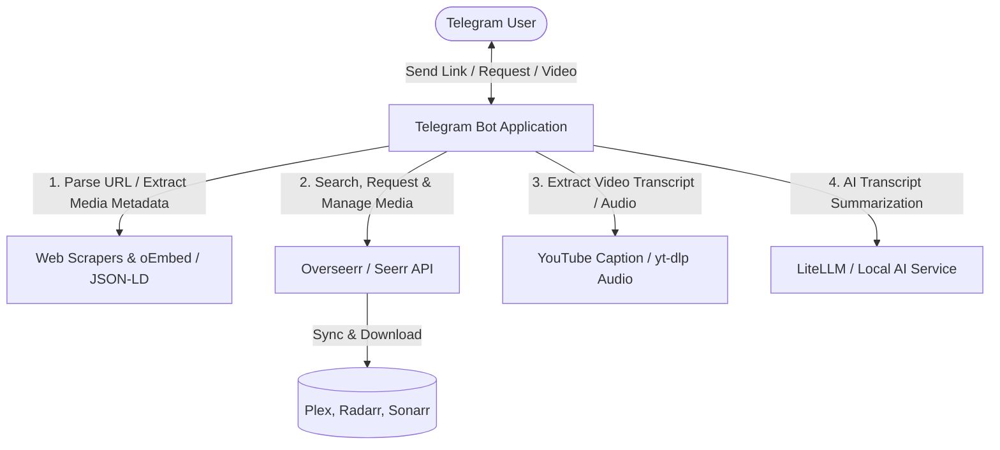

# Movie Request Agent (`my-media-aigent`)

A production-ready, modular, fault-tolerant Python Telegram Bot and AI assistant that parses media links, searches and requests content via Overseerr/Seerr, and performs AI-powered video transcript summarization using a local LiteLLM instance.

---

## 🏗️ Architecture Target & Overview


```mermaid
graph TD
    User([Telegram User]) <-->|Send Link / Request / Video| Bot[Telegram Bot Application]
    Bot -->|1. Parse URL / Extract Media Metadata| Scraper[Web Scrapers & oEmbed / JSON-LD]
    Bot -->|2. Search, Request & Manage Media| Overseerr[Overseerr / Seerr API]
    Bot -->|3. Extract Video Transcript / Audio| Extractor[YouTube Caption / yt-dlp Audio]
    Bot -->|4. AI Transcript Summarization| LiteLLM[LiteLLM / Local AI Service]
    Overseerr -->|Sync & Download| Servarr[(Plex, Radarr, Sonarr)]
```

### Directory Structure

```
my-media-aigent/
├── config.py                 # Centralized Pydantic Settings (Validation & Env Vars)
├── bot/
│   ├── main.py               # Application entry point & bot lifecycle
│   ├── middleware.py         # Global error boundaries & authorization middleware
│   ├── parser.py            # Link parsing & web metadata scrapers
│   └── handlers/             # Decoupled Telegram command/message handlers
│       ├── __init__.py
│       ├── overseerr.py      # Overseerr media search, links, & request management
│       └── video.py          # YouTube & Instagram AI extraction handlers
├── services/                 # Independent business logic & HTTP clients
│   ├── __init__.py
│   ├── overseerr.py          # Resilient Overseerr AsyncClient
│   ├── llm.py                # LiteLLM client with token guardrails
│   └── extractor.py          # YouTube & Instagram media extraction service
├── models/                   # Pydantic schemas and domain DTOs
│   ├── __init__.py
│   └── media.py
├── dev_tools/
│   └── watch.py             # Hot-reload development script
├── Dockerfile                # Hardened container definition with ffmpeg
├── compose.yaml              # Docker Compose deployment definition
└── requirements.txt          # Python dependencies
```

---

## 🚀 Key Features

1. **Smart Link Scraping & Media Requesting:** Automatically extracts titles and metadata from IMDb, Letterboxd, TMDB, MyAnimeList, AniList, Netflix, etc., and searches Overseerr.
2. **Direct TMDB Bypass & Confirmation Cards:** Instant match for direct TMDB links with rich confirmation cards containing posters, rating scores (TMDb, RT, IMDb), classification, runtime, directors, and streaming provider icons (Netflix, Max, Prime Video, Disney+, etc.).
3. **AI Video & Description Extraction:** Scrapes video transcripts and metadata descriptions from YouTube and Instagram Reels (`yt-dlp` + `ffmpeg`), uses a multilingual prompt (PT-BR, EN, FR) for Whisper STT audio transcription (`audio.transcriptions.create`), and analyzes both transcript and post description via LiteLLM (`DEFAULT_LLM_MODEL`) to identify mentioned movies/TV shows for direct Overseerr requesting.
4. **Overseerr Request Management (`/seerr`):** View recent requests, approve, decline, retry failed requests (with exponential backoff retries), or delete requests directly within Telegram.
5. **Centralized Configuration & Resilience:** Strict startup validation via Pydantic `BaseSettings`, Docker secrets support, and `httpx.AsyncClient` with custom timeouts and error boundaries.

---

## ⚙️ Configuration Parameters (`config.py`)

All settings are configured via `.env` files, environment variables, or Docker secrets.

| Parameter | Type | Default | Description |
| :--- | :--- | :--- | :--- |
| `TELEGRAM_BOT_TOKEN` | `SecretStr` | Required | Telegram bot token from `@BotFather`. |
| `TELEGRAM_ALLOWED_USERS` | `list[int]` | `[]` | Optional whitelist of Telegram user IDs. Empty allows all users. |
| `OVERSEERR_URL` | `HttpUrl` | Required | Base URL of your Overseerr/Seerr instance. |
| `OVERSEERR_API_KEY` | `SecretStr` | Required | Overseerr API Key. |
| `OVERSEERR_TIMEOUT` | `float` | `10.0` | HTTP request timeout in seconds for Overseerr API calls. |
| `OVERSEERR_SSL_VERIFY`| `bool` | `True` | Whether to verify SSL certificates for Overseerr requests. |
| `LITELLM_BASE_URL` | `str` | Required | OpenAI-compatible endpoint for local LiteLLM service. |
| `LITELLM_API_KEY` | `SecretStr` | Required | API Key for LiteLLM service. |
| `DEFAULT_LLM_MODEL` | `str` | Required | LLM model name used for transcript analysis. |
| `MAX_TRANSCRIPT_TOKENS`| `int` | `3000` | Token guardrail to prevent local GPU OOM context crashes. |
| `LOG_LEVEL` | `str` | `"INFO"` | Application logging verbosity (`DEBUG`, `INFO`, `WARNING`, `ERROR`). |

### Docker Secrets & File Loading

The application automatically checks for secrets in the following order:
1. `<KEY>_FILE` environment variable path (e.g. `TELEGRAM_BOT_TOKEN_FILE=/path/to/token.txt`).
2. Docker secrets default directory (`/run/secrets/telegram_bot_token`, `/run/secrets/overseerr_api_key`).
3. Direct environment variable (`TELEGRAM_BOT_TOKEN`, `OVERSEERR_API_KEY`).

---

## 🛠️ Getting Started

### 1. Create Secret Files (Optional if using direct env)

```bash
echo "YOUR_TELEGRAM_BOT_TOKEN" > telegram_bot_token.txt
echo "YOUR_OVERSEERR_API_KEY" > overseerr_api_key.txt
```

### 2. Run with Docker Compose

```bash
docker compose up -d --build
```

---

## 📱 Telegram Usage Guide

1. **Start Bot:** Send `/start` to view the welcome message and supported features.
2. **Request Media via Links or Title:**
   - **Send a link:** `https://www.imdb.com/title/tt0111161/` or `https://themoviedb.org/movie/278`
   - **Type a title:** `Inception (2010)` or `Breaking Bad`
3. **Summarize Video Content:**
   - Send any YouTube video/shorts link or Instagram Reel URL to automatically trigger transcript extraction and AI summarization.
4. **Manage Overseerr Requests:**
   - `/seerr list`: List the last 5 media requests on Seerr.
   - `/seerr [number]`: List the last `N` media requests (1-20).
   - `/seerr ?`: Show help message for requests management.

---

## 🧑‍💻 Local Development

```bash
# Create and activate virtual environment
python3 -m venv .venv
source .venv/bin/activate

# Install dependencies
pip install -r requirements.txt

# Export environment variables
export TELEGRAM_BOT_TOKEN="your_bot_token"
export OVERSEERR_API_KEY="your_overseerr_api_key"
export OVERSEERR_URL="http://localhost:5055"

# Run development hot-reload watcher
python dev_tools/watch.py
```
